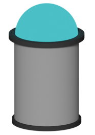

# Silo

Key-Value Store to easily add persistence to your application. 

## Example

### Basic

Direct ist most simple without any persistence. Stores direct in-memory. See [examples/basic.go](examples/basic.go):

```golang
package main

import (
	"fmt"

	"github.com/RaphaelPour/silo"
)

func main() {
	// create a new direct silo
	store := silo.NewDirect()

	// set a key
	err := store.Set("favorite-color", "purple")
	if err != nil {
		fmt.Println(err)
		return
	}

	// get key and print value
	rawValue, err := store.Get("favorite-color")
	if err != nil {
		fmt.Println(err)
		return
	}

	value, ok := rawValue.(string)
	if !ok {
		fmt.Println("value is not a string")
		return
	}

	fmt.Printf("favorite-color: %s\n", value)

	// delete key
	err = store.Delete("favorite-color")
	if err != nil {
		fmt.Println(err)
		return
	}
}
```

### File

Uses a file for persistence storage. Saves and loads automatically. Just restart the application and `Get` a key. [examples/file.go](examples/file.go):

```golang
package main

import (
	"fmt"

	"github.com/RaphaelPour/silo"
)

func main() {
	// create a new file-based silo
	store := silo.NewFile("data.store")

	// set a key
	err := store.Set("favorite-color", "purple")
	if err != nil {
		fmt.Println(err)
		return
	}

	// get key and print value
	rawValue, err := store.Get("favorite-color")
	if err != nil {
		fmt.Println(err)
		return
	}

	value, ok := rawValue.(string)
	if !ok {
		fmt.Println("value is not a string")
		return
	}

	fmt.Printf("favorite-color: %s\n", value)

	// delete key
	err = store.Delete("favorite-color")
	if err != nil {
		fmt.Println(err)
		return
	}
}

```

### API - blob storage

REST-API storing anything as bytes. Use the route `POST /<key>` for setting a key where the body is the value. Use `GET /<key>` for getting a key.

```go
package main

import (
	"fmt"
	"io/ioutil"
	"net/http"

	"github.com/RaphaelPour/silo"
)

// $ go run api.go
// $ curl -X POST -d "value" http://localhost:8000/key
// $ curl http://localhost:8000/key
// $ value

func main() {
	store := silo.NewFile("blob.storage")
	api := http.NewServeMux()
	api.HandleFunc("/", func(w http.ResponseWriter, req *http.Request) {
		key := req.URL.Path[1:]

		if req.Method == http.MethodGet {
			value, err := store.Get(key)
			if err != nil {
				w.WriteHeader(http.StatusInternalServerError)
				fmt.Fprintf(w, err.Error())
				return
			}
			w.WriteHeader(http.StatusOK)
			fmt.Fprintf(w, "%s", value)
		} else if req.Method == http.MethodPost {
			body, err := ioutil.ReadAll(req.Body)
			if err != nil {
				w.WriteHeader(http.StatusInternalServerError)
				fmt.Fprintf(w, err.Error())
				return
			}
			if err := store.Set(key, body); err != nil {
				w.WriteHeader(http.StatusInternalServerError)
				fmt.Fprintf(w, err.Error())
				return
			}
			w.WriteHeader(http.StatusOK)
		}
	})

	http.ListenAndServe(":8000", api)
}
```

### Log

Add a log layer onto the basic storage driver to record any action taking place:

```go
package main

import (
	"fmt"

	"github.com/RaphaelPour/silo"
)

func main() {
	// create a new direct silo
	store := silo.NewDirect()
	store, err := silo.NewLog(store, "test.log")
	if err != nil {
		fmt.Println(err)
		return
	}

	// set a key
	err = store.Set("favorite-color", "purple")
	if err != nil {
		fmt.Println(err)
		return
	}

	// get key and print value
	rawValue, err := store.Get("favorite-color")
	if err != nil {
		fmt.Println(err)
		return
	}

	value, ok := rawValue.(string)
	if !ok {
		fmt.Println("value is not a string")
		return
	}

	fmt.Printf("favorite-color: %s\n", value)

	// delete key
	err = store.Delete("favorite-color")
	if err != nil {
		fmt.Println(err)
		return
	}
}
```

```bash
$ cat test.log
2024-01-30 17:10:13 [   SET] favorite-color=purple err=<nil>
2024-01-30 17:10:13 [   GET] favorite-color=purple err=<nil>
2024-01-30 17:10:13 [DELETE] favorite-color err=<nil>
```
